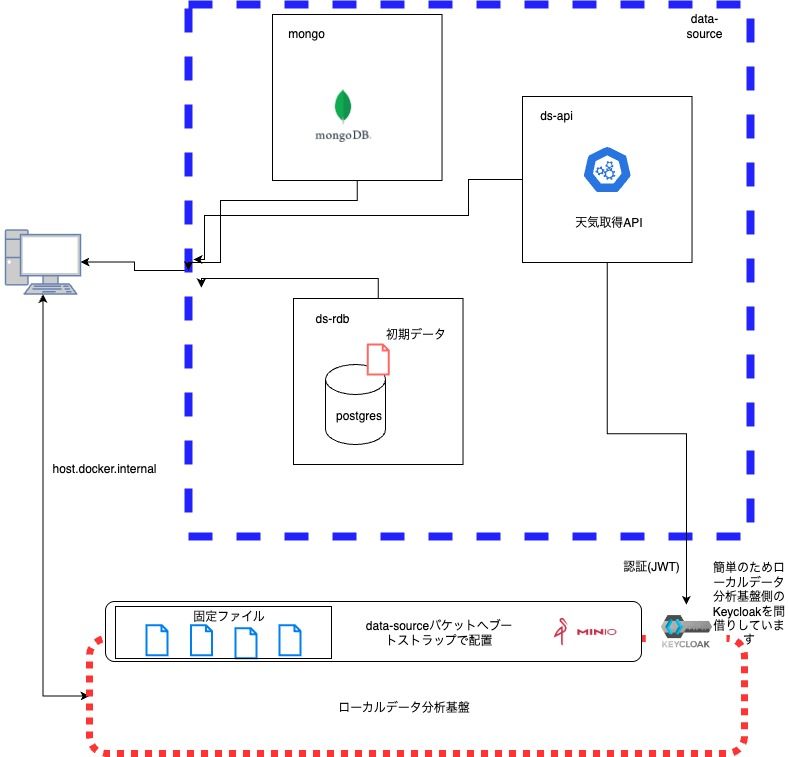

# data-source

<p align="center"><b>以下の書籍に関するリポジトリです。データソースを担当します</b></p>

<p align="center">
    <a href="https://www.amazon.co.jp/dp/4297145634/ref=sspa_dk_detail_0?psc=1&pd_rd_i=4297145634&pd_rd_w=BXEhW&content-id=amzn1.sym.f293be60-50b7-49bc-95e8-931faf86ed1e&pf_rd_p=f293be60-50b7-49bc-95e8-931faf86ed1e&pf_rd_r=VZ7P7XN3YX1NAMJAPZEB&pd_rd_wg=CuOVv&pd_rd_r=31953068-34be-40e1-978d-b417f6b20227&s=books&sp_csd=d2lkZ2V0TmFtZT1zcF9kZXRhaWw">
        
    </a>
    <a href>
        
    </a>
</p>

<div align="center">
    


[](https://github.com/yk-st/data-source/releases)


</div>

# 全体構成



データソースの技術選択に関しては以下を基準としています。

- Webは活動がデジタル化されているケースが非常に多く、具体例として分かりやすい。
- 業界固有の指標（財務指標など）をベースにすると、言葉の定義や説明が煩雑になり、理解できない人が増えるため避けました。

データソースとしての役割を担っています。データベースとしてds_rdb、APIとしてds_api、静的ファイルをMinIOへ配置しています。
基本的にホストを通してローカルデータ分析基盤と接続します。

## 構成要素

- [ds_api](ds_api/README.md) - APIを提供するコンテナです。天気のAPIを実装しています。
- [ds_rdb](ds_rdb/README.md) - データソースのデータベースを提供するコンテナです。ordersやpeopleなどのデータを保存しています。
- [mongo](mongo/README.md) - MongoDBを提供するコンテナです。リバースETLの受け口としてや、リアルタムデータの格納のために利用しています。

### 固定データの配置
接続情報に記載のバケットなどを作成しdata-sourceバケットへ初期データを配置している。

- fixed_dataset/fund -> ファンド関連のCSVデータ
- fixed_dataset/legacy -> 別システム or 旧システム想定のファンドやOrdersデータのCSV
- fixed_dataset/ref -> 参照データ用CSV
- fixed_dataset/wrangling -> ラングリング用データ(pdfやexecelなど)

各データの中身は、data-platform-on-local/airflow/README.mdを参照してください。

## APIのデータサンプル
利用することよにって返却されるデータのサンプルです

リクエスト
```
read -r -d '' BODY <<'JSON'
[
  {"lat": 35.46, "lon": 139.62, "dt": "2025-05-05T09:00:00Z"},
  {"lat": 43.06, "lon": 141.34, "dt": "2025-05-05T09:00:00Z"}
]
JSON

echo $BODY

curl -s -X POST "http://api.local.datasource:8000/weather" \
  -H "Authorization: Bearer $TOKEN" \
  -H "Content-Type: application/json" \
  -d "$BODY" | jq

```

レスポンス
```
[
  {
    "lat": 35.46,
    "lon": 139.62,
    "dt": "2025-05-05T09:00:00Z",
    "temperature_c": 23,
    "condition": "SUNNY",
    "generated_at": "2025-07-22T13:22:01Z"
  },
  {
    "lat": 43.06,
    "lon": 141.34,
    "dt": "2025-05-05T09:00:00Z",
    "temperature_c": 5,
    "condition": "WINDY",
    "generated_at": "2025-07-22T13:22:01Z"
  }
]

```

# セットアップ手順

```
git clone https://github.com/yk-st/data-source.git -b v1.0.0
```

※ -bはv1.x.xの最新のタグを指定してください。

クローン後は各ディレクトリでdocker compose upコマンドを実行してください。

## 起動順の制約
なし

# コンテナ利用時の注意点
host.docker.internalを使って通信している部分があるためLinux系OS利用の方はextra_hostsの設定が必要になる場合があります。